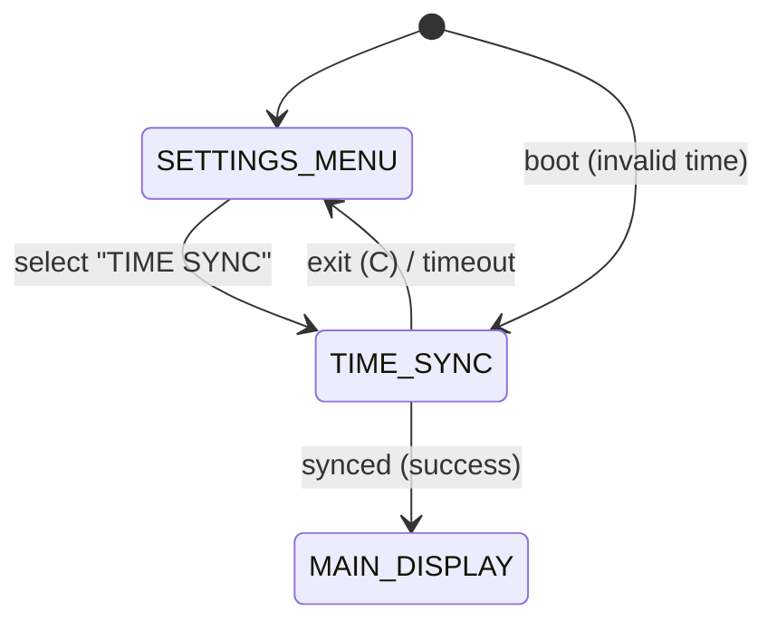

# UIレイヤの画面遷移・状態管理設計書

本ドキュメントは、AimatixのUIレイヤにおける画面遷移・状態管理設計（責務分離・nextMode設計・状態遷移テーブル・イベント通知・副作用管理）を明文化するものです。

---

## 1. 設計方針・責務分離

- **UI層（main.cpp, ui.cpp等）**
  - 物理ボタンイベントを検出し、`nextMode`関数で画面遷移（currentModeの更新）を一元管理
  - currentModeに応じてUI描画関数（drawMainDisplay, drawInputDisplay等）を呼び分け
  - 設定保存・反映・リセット等もmain.cppで集中管理
  - ロジック層のAPIは「成否・エラー内容・必要情報」だけを戻り値やイベントで受け取り、UI遷移や画面制御はUI層でのみ行う
  - **副作用（UI更新・保存・通信等）はコマンド/イベント駆動で一元管理する**

- **ロジック層**
  - 純粋ロジックのみ担当し、UI遷移や画面制御は一切行わない
  - 副作用（保存・通信等）はインターフェース経由またはコマンド/イベント駆動で一元管理

---

## 2. 画面遷移・状態管理の実装例

### 2.1 nextMode関数による画面遷移
- 物理ボタンイベント発生時に `nextMode(currentMode, ButtonType, ButtonAction)` を呼び出し、currentModeを更新
- 例:
```cpp
if (buttonManager.isShortPress(BUTTON_TYPE_B)) {
  currentMode = nextMode(currentMode, BUTTON_TYPE_B, SHORT_PRESS);
}
switch (currentMode) {
  case MAIN_DISPLAY: drawMainDisplay(); break;
  case ABS_TIME_INPUT: drawInputDisplay(); break;
  // ...他モード
}
```

### 2.2 状態遷移テーブル（state_transition.md参照）
- 各モード・ボタンイベントごとの遷移先・アクションを明確に定義
- nextMode関数はこのテーブルに従い純粋関数として実装

### 2.3 コマンド/イベント駆動による副作用一元管理
- ロジック層のAPIは戻り値やコマンド/イベントリストでUI層に通知
- UI層はコマンド/イベントを受けて画面遷移・UI更新・副作用実行を一元管理
- 例:
```cpp
for (const auto& cmd : handleEvent(event)) {
    switch (cmd.type) {
        case CommandType::UpdateUI: drawMainDisplay(); break;
        case CommandType::SaveSettings: saveSettings(settings, &eepromAdapter); break;
        case CommandType::ShowWarning: showWarning(cmd.message); break;
    }
}
```

---

## 3. 設計メリット
- UI層とロジック層の責務分離が明確になり、テスト容易性・拡張性が向上
- UI以外の副作用（保存・通信等）も同じ仕組みで柔軟に追加可能
- 設計・実装・レビュー・保守が容易になる

---

## 4. 参考：状態遷移テーブル（state_transition.md抜粋）

| 現在モード         | ボタンイベント | アクション   | 次モード           |
|--------------------|----------------|-------------|--------------------|
| MAIN_DISPLAY       | A短押し        | NOP         | ABS_TIME_INPUT     |
| MAIN_DISPLAY       | B短押し        | NOP         | REL_PLUS_TIME_INPUT|
| MAIN_DISPLAY       | C短押し        | NOP         | ALARM_MANAGEMENT   |
| MAIN_DISPLAY       | C長押し        | NOP         | SETTINGS_MENU      |
| ...                | ...            | ...         | ...                |

- 詳細は`doc/spec/state_transition.md`を参照

---

## 5. 今後の拡張方針
- コマンド/イベント型の拡張は標準設計方針とし、全ての副作用をこの方式で管理
- Effect/Command Dispatcherによる副作用一元管理も必須とする

---

## StateManager（状態遷移管理クラス）の導入

### 目的
- 画面（Display）やロジック（Logic）を「状態」として一元管理し、ボタン操作やイベントに応じて状態遷移・画面遷移を制御する。
- UIレイヤの状態遷移の責務を明確化し、拡張性・テスト容易性を高める。

### 基本設計
- StateManagerは「現在の状態（画面/ロジック）」を保持し、状態遷移APIを提供する。
- 各Display/Logicは「状態」としてStateManagerに登録される。
- ボタン操作やコマンドイベントに応じて、StateManagerが状態遷移を実行する。
- 状態ごとに描画・入力処理を委譲する（例：draw(), onButtonA(), onButtonCLongPress() など）。

### インターフェース例（C++擬似コード）
```cpp
class IState {
public:
    virtual void onEnter() = 0;
    virtual void onExit() = 0;
    virtual void onDraw() = 0;
    virtual void onButtonA() = 0;
    virtual void onButtonB() = 0;
    virtual void onButtonC() = 0;
    virtual void onButtonALongPress() = 0;
    virtual void onButtonCLongPress() = 0;
    // ... 必要に応じて拡張
};

class StateManager {
public:
    void setState(IState* state);
    IState* getCurrentState();
    void handleButtonA();
    void handleButtonCLongPress();
    // ...
};
```

### 実装・拡張方針
- 各Display/LogicはIStateを実装し、StateManagerに登録する。
- 画面遷移・状態遷移のテストもStateManager経由で行う。
- 今後のAlarmDisplay, SettingsDisplay等も同様に拡張可能。

---

（2025/01/xx 3-0-4対応 追記）

## TIME SYNC (QR)

- Entry: `SETTINGS_MENU` → select "TIME SYNC"
- Entry (boot auto): `BOOT` → `TIME_SYNC`（条件: `TimeValidationLogic` により時刻が無効〈基準日 `2025-01-01 00:00` 未満〉と判定された場合）
- Exit:
  - success → `MAIN_DISPLAY`
  - cancel/timeout → `SETTINGS_MENU`
- Buttons: A = REISSUE, C = EXIT（Bは未使用）
- Tick policy: `TimeSyncDisplayState.onDraw()` 内で `ITimeSyncController.loopTick()` を毎フレーム呼ぶ（約20Hz）
- Sync method: SoftAP + QR のみ（本起動時自動同期では NTP 自動同期は使用しない）
- Dialog policy: 提案ダイアログは表示しない（自動開始）



Call flow (proposal A):
```
loop() → StateManager.getCurrentState() → onDraw()
  → TimeSyncDisplayState.onDraw() → controller.loopTick() → view更新
```